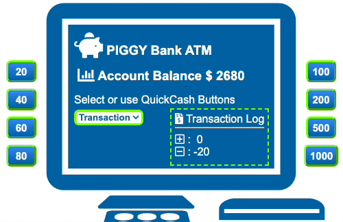

<div align="center" id="top"> 
  

&#xa0;

  <!-- <a href="https://reactatm.netlify.app">Demo</a> -->
</div>

<h1 align="center">:atm: React ATM :moneybag:</h1>

<p align="center">
  

  

  

  

  

  <!--  -->

  <!--  -->
</p>

<!-- Status -->

<!-- <h4 align="center"> 
	🚧  React Atm 🚀 Under construction...  🚧
</h4> 

<hr> -->

<p align="center">
  <a href="#dart-about">About</a> &#xa0; | &#xa0; 
  <a href="#sparkles-features">Features</a> &#xa0; | &#xa0;
  <a href="#rocket-technologies">Technologies</a> &#xa0; | &#xa0;
  <a href="#white_check_mark-requirements">Requirements</a> &#xa0; | &#xa0;
  <a href="#checkered_flag-starting">Starting</a> &#xa0; | &#xa0;
  <a href="#memo-license">License</a> &#xa0; | &#xa0;
  <a href="https://github.com/ajdavidson" target="_blank">Author</a>
</p>

<br>

## :eye_speech_bubble: About ##

React ATM Simulator. Refactoring assignment started with setting the increments to be of 20 for the input field. A
minimum of 0 and maximum of 1000 was also set. KeyPress and Paste were also suppressed to enforce a 20 step imitation. A
field of buttons was created to simulate the QuickCash withdrawal feature. Many conditions were programmed to ensure
continued validity. Provided an async message area with dynamic response using state. Animated transaction indicator
lights. Transaction log of running gross total deposits and withdrawals.

## :sparkles: Features ##

:heavy_check_mark: Set to work with increments of 20 max 1000\
:heavy_check_mark: Many conditions programmed to assure validity\
:heavy_check_mark: Dynamic async response message element\
:heavy_check_mark: QuickCash feature\
:heavy_check_mark: Transaction animated indicator lights\
:heavy_check_mark: Transaction log

## :rocket: Technologies ##

The following tools were used in this project:

- [JavaScript](https://www.ecma-international.org/)
- [CSS](https://www.w3.org/TR/CSS/#css)
- [HTML](https://whatwg.org/)
- [Babel](https://babeljs.io/)
- [Node.js](https://nodejs.org/en/)
- [React](https://pt-br.reactjs.org/)

## :white_check_mark: Requirements ##

Before starting :checkered_flag:, you need to have [Git](https://git-scm.com) and [Node](https://nodejs.org/en/)
installed.

## :checkered_flag: Starting ##

```bash
# Clone this project
$ git clone https://github.com/ajdavidson/react-atm

# Access
$ cd react-atm

# Install dependencies
$ http-server

# Run the project
$ Available on:
  http://127.0.0.1:8080
  http://localhost:8080


# The server will initialize in the <http://localhost:8080>
```

## :memo: License ##

This project is under license from MIT. For more details, see the [LICENSE](LICENSE.md) file.

Made with :heart: by <a href="https://github.com/ajdavidson" target="_blank">AJD</a>

&#xa0;

<a href="#top">Back to top</a>
